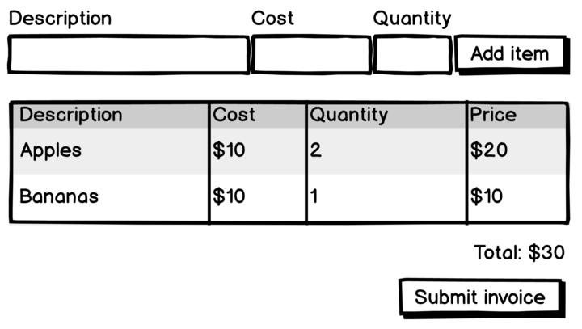

## Instructions

Hello and welcome to the Xero Front-End Developer pre-interview exercise!

To get a better idea of your skills, we'd like you to implement a basic invoicing UI based on a wireframe design.

This repository was bootstrapped with [Create React App](https://github.com/facebookincubator/create-react-app). 

A junior developer started writing some code in `src/App.js`. Feel free to use or adapt that if it's useful.

We want to see code that speaks to your strengths. If you feel your strengths are in design and CSS, then please feel free to spend the time on making the form more beautiful than the wireframe. If your strengths are in JavaScript/TypeScript, then feel free to focus on the logical aspects of the functionality - think about what will make you and your strengths shine!

## Things to consider as you build your masterpiece

- Consider how the app would look on different devices e.g. mobile vs web.
- TypeScript is our preferred language... just saying.. ;-)
- We love well tested code consider what tests to add that will ensure your code is robust.
- We expect you to spend around 2 - 3 hours on this exercise but this is only a guide so feel free to deviate from this.

## The UI and functionality we'd like you to build

The design consists of three input fields and a button laid out horizontally. The input fields are: Description, Cost and Quantity. 

The button text is "Add item", and when clicked, it should add a new row to a table below the input fields. 

The table has four columns: Description, Cost, Quantity, and Price, where the Price is the Cost of the item multiplied by the Quantity.

Below the table is a right-aligned total that contains the sum of all prices in the table.

Below the total is a right-aligned button with the text "Submit invoice". When clicked, this would normally make a call to a backend, but for this exercise, you can just make a call to `console.log` with the data you would send to a backend API.

We don't expect you to complete everything, but we'd like you to write down (at the bottom of this file) a high-level overview of what else you would do to complete the task, and then what else you might do to to get the code to a production-grade state.

We look forward to seeing what you come up with!

## Your write-up

I think I could have done more in the design aspect if I had used SCSS along with some lightweight framework.

~~Edit or Remove Invoice.~~  

Create list of accounts where you can switch between accounts and add/update invoice items.

Add filter in the invoice list and filter by keyword.

Create product / services to manage price and inventory overview.

Calendar Integration for invoice scheduling.